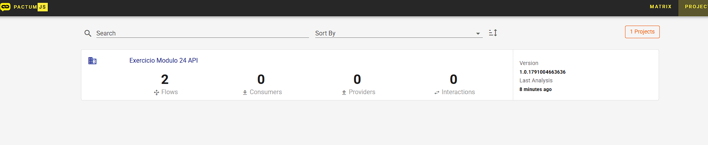
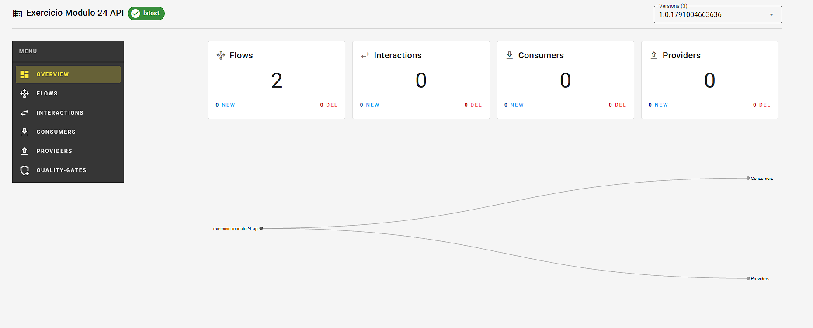
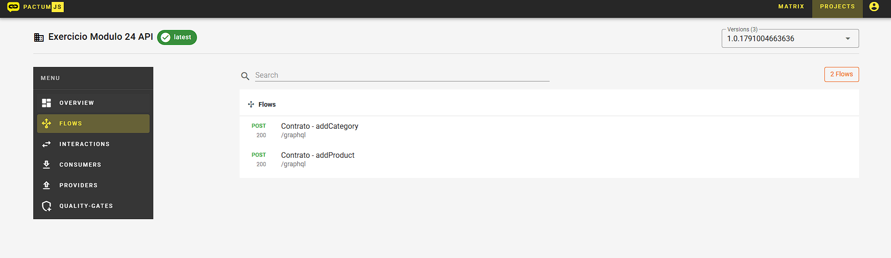

# Exercício Módulo 24 - Automação de API

Projeto desenvolvido para o exercício do Módulo 24 do curso de Engenharia de Qualidade de Software da EBAC.

Foram implementados testes automatizados de API utilizando PactumJS, Mocha e GraphQL.

## Cenários automatizados

### Categorias
- addCategory
- editCategory
- deleteCategory

### Produtos
- addProduct
- editProduct
- deleteProduct

## Testes de contrato

Foram implementados testes de contrato utilizando Pactum Flow para:

- addCategory
- addProduct

## Tecnologias utilizadas

- Node.js
- Mocha
- PactumJS
- GraphQL
- Pactum Flow
- Docker

## Executando o projeto

Instale as dependências:

```bash
npm install
```

Inicie os serviços do Pactum Flow e MongoDB com Docker:

```bash
docker compose up -d
```

Execute os testes:

```bash
npm test
```

Para visualizar os contratos publicados no Pactum Flow:

```text
http://localhost:8080/#/projects
```

## Resultado

A suíte completa possui 9 testes automatizados, contemplando autenticação, categorias, produtos e contratos.

## Evidências

### Projeto publicado no Pactum Flow



### Resumo do projeto



### Contratos publicados


