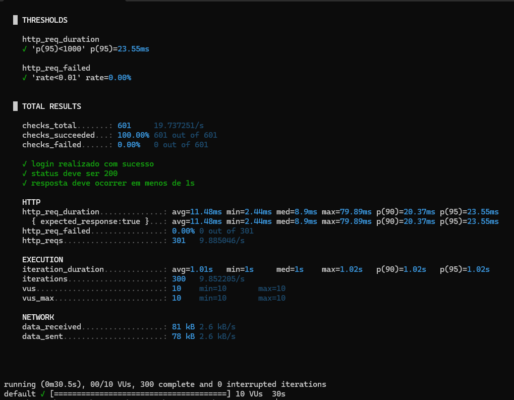
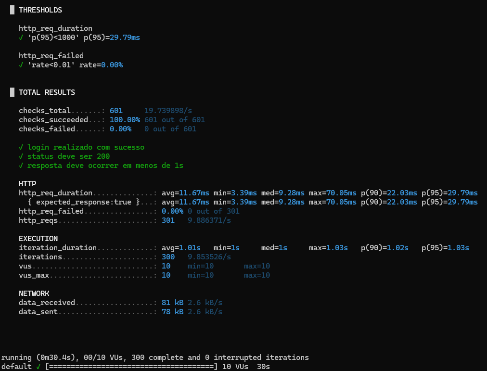

# Módulo 28 - Testes de Performance

Exercício de implementação de testes de performance utilizando k6.

Os testes foram realizados sobre a API `ebac-demo-store-server`, contemplando os endpoints de Produtos e Clientes.

## Cenários

Foram criados testes para:

- consulta de produtos;
- consulta de clientes.

Os dois cenários realizam autenticação antes da execução das requisições.

## Configuração

- 10 usuários virtuais;
- duração de 30 segundos;
- p95 abaixo de 1 segundo;
- taxa de falhas inferior a 1%.

## Execução

Produtos:

```bash
k6 run performance/produtos.js
```

Clientes:

```bash
k6 run performance/clientes.js
```

## Resultado

Produtos:

- 300 iterações;
- 0% de falhas;
- p95 de 23,55 ms.

Clientes:

- 300 iterações;
- 0% de falhas;
- p95 de 29,79 ms.

Os dois testes foram executados com sucesso.

## Evidências

### Produtos



### Clientes


